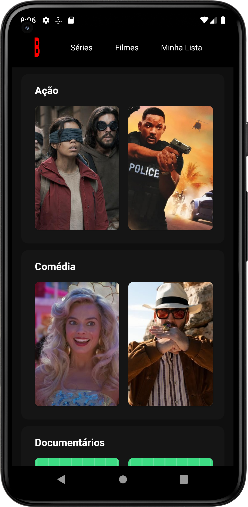
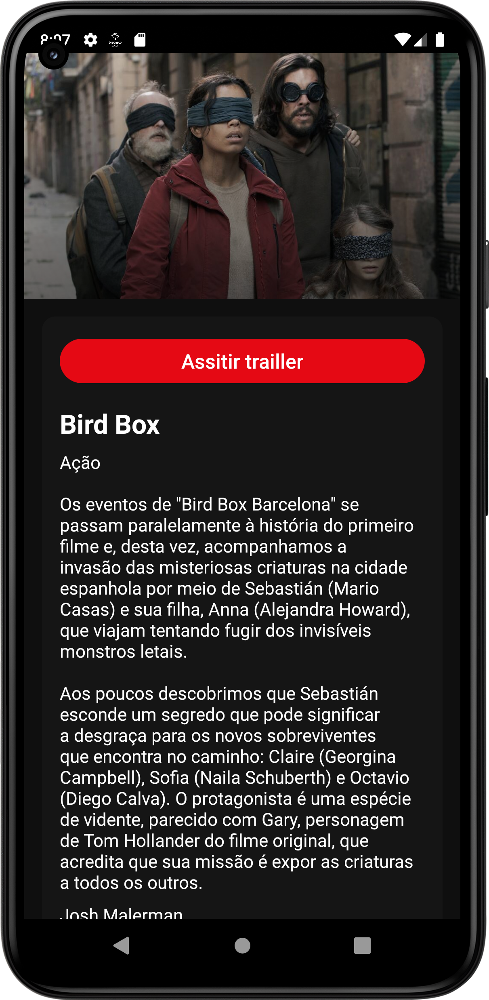
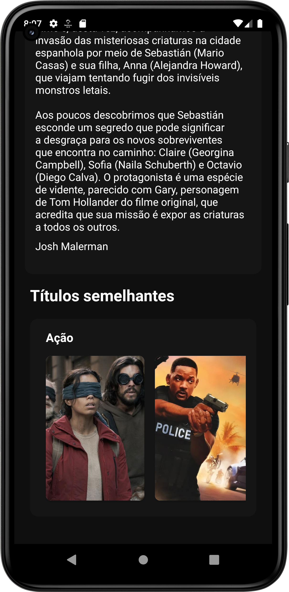

<h1 align="center">APLICATIVO BRUNOFLIX</h1>

<p align="center">
  <a href="https://opensource.org/licenses/Apache-2.0"></a>
  <a href="https://android-arsenal.com/api?level=26"></a>
  <br>
  <a href="https://wa.me/+5553984664022"></a>
  <a href="https://www.linkedin.com/in/lorranfranzbastos/"></a>
  <a href="mailto:lorranfranzbastos1@gmail.com"></a>
</p>

[](https://visitcount.itsvg.in)

<p float="left" align="center">

</p>


<p float="left" align="center">



</p>


⭐ Esse é um projeto de estudo onde trabalho com Recyclerview Horizontal e Vertical, Intents, Click do item para navegar para pagina de descrição do filme. Inicialmente criei o projeto com activity, mas irei passar para fragment e também trabalhar a parte dos filmes com requisições em uma API com Retrofit.

📐 Aplicativo de listagem de filmes com base no Netflix a parte de scroll horizontal e vertical!

</p>

</br>

## Tecnologias usadas e bibliotecas de código aberto

- Minimum SDK level: 26.
- [Linguagem Kotlin](https://kotlinlang.org/) 

  - Jetpack 
  - Lifecycle: Observe os ciclos de vida do Android e manipule os estados da interface do usuário após as alterações do ciclo de vida.
  - ViewBinding: Liga os componentes do XML no Kotlin através de uma classe que garante segurança de tipo e outras vantagens.
  - Custom Views: View customizadas feitas do zero usando XML.
  - [...]

- Features e melhorias a serem implementadas:
  - Passar de Activity para Fragment;
  - Consumir API com Retrofit;
  - SplashScreen;
  - [...]


# Licença


```xml

   Copyright [2023] [Lorran Franz Bastos]

   Licensed under the Apache License, Version 2.0 (the "License");
   you may not use this file except in compliance with the License.
   You may obtain a copy of the License at

   http://www.apache.org/licenses/LICENSE-2.0

   Unless required by applicable law or agreed to in writing, software
   distributed under the License is distributed on an "AS IS" BASIS,
   WITHOUT WARRANTIES OR CONDITIONS OF ANY KIND, either express or implied.
   See the License for the specific language governing permissions and
   limitations under the License.

```
